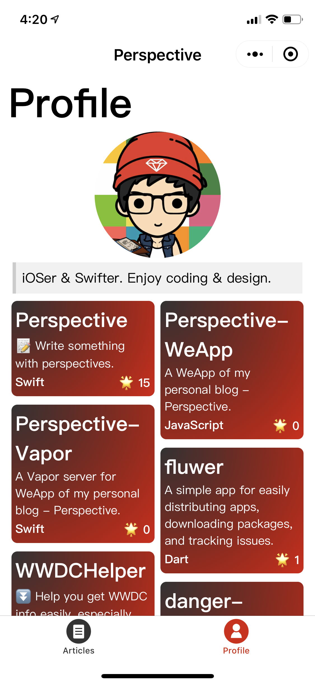
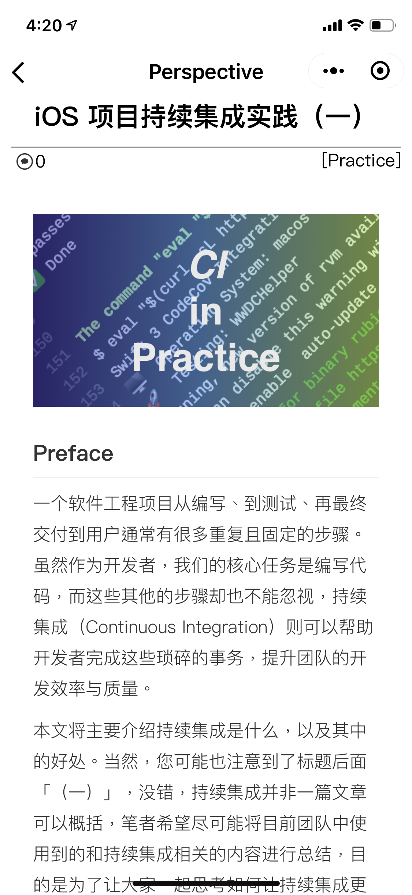

# Perspective-WeApp

A WeApp of my personal blog - Perspective.

## WeApp QRCode

- Scan this QR code by your Wechar client:

## Screenshots

## Features

- [x] List articles
- [x] Show one article in Markdown format
- [x] Show my profile
- [x] Pull to refresh
- [x] Pull to load
- [ ] List comments
- [ ] Search articles by keywords

## Back-End

- [Perspective-Vapor - in Swift](https://github.com/kingcos/Perspective-Vapor)

## LICENSE

- MIT
